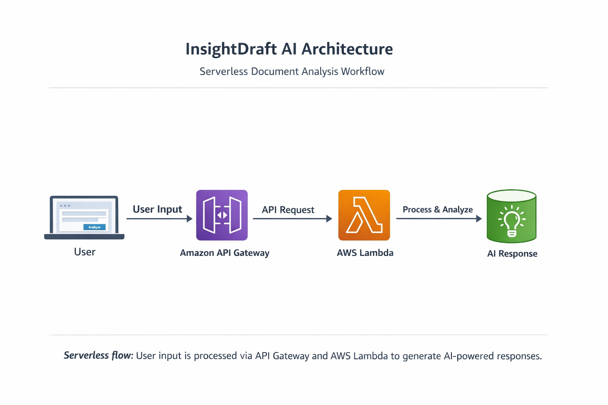

# InsightDraft: Serverless Gen AI Document Analyser

InsightDraft is a full-stack, cloud-native application designed to demonstrate the integration of Generative AI workflows within a Serverless Architecture. The system allows users to upload document context and receive AI-driven insights via a decoupled API.

### 🌐 Live Demo

https://raineybon07.github.io/insightdraft-ai/

---

# 🧠 Project Overview

This project demonstrates how to build and connect a frontend interface with a serverless backend using AWS services.

### Users can:
- Paste any document content
- Ask questions about the document
- Receive AI-generated insights in real time

---

# ⚙️ Tech Stack & 🏗️ Architecture

This project follows modern Software Development Life Cycle (SDLC) principles, focusing on scalability, security, and separation of concerns.

## Visual Overview

This diagram illustrates the serverless flow from user input to AI-generated response using AWS services.

## How it Works

Frontend: HTML5, CSS3, and JavaScript (ES6+), hosted via GitHub Pages.
⬇️
Backend: Python 3.x running on AWS Lambda (Serverless computing).
⬇️
API Layer: Amazon API Gateway (RESTful interface with CORS integration).
⬇️
DevOps: Version control via Git/GitHub and event-driven cloud deployment.
⬇️
Response returned to the browser

---

# 💡 Key Engineering Features

- Event-Driven Logic: Utilises AWS Lambda's event triggers to process JSON payloads dynamically.

- Prompt Engineering: Implements backend logic to structure user queries into "Context + Question" prompts, a foundational skill for Gen AI systems.

- Security & Scalability: Built using a serverless model that handles "Cold Starts" and scales automatically with user demand while maintaining a zero-maintenance footprint.

- Robust Error Handling: Features "Safe-Parsing" logic to handle null inputs and browser GET requests without system failure (500 errors).

---

# 📈 System Flow

- User Input: User enters a document and a question into the Frontend.
  
- API Call: JavaScript fetch() sends a POST request to the Amazon API Gateway.

- Cloud Execution: API Gateway triggers the AWS Lambda function.

- AI Logic: The Python backend processes the text and prepares a context-aware response.

- Response: The result is sent back as a JSON object and rendered instantly in the browser.

---

# 🚀 Getting Started

### 1. Clone the repository

git clone https://github.com/raineybon07/insightdraft-ai.git
cd insightdraft-ai

### 2. Open locally

### You can either:
	•	Open index.html directly in your browser
	•	Or use a local server (recommended):

### If using VS Code Live Server

Right-click → Open with Live Server

---

# 🔐 Configuration

### Update the API endpoint inside index.html:

fetch ('https://q8so9ngalk.execute-api.us-east-1.amazonaws.com/default/InsightDraft-Backend') {

### Ensure your API Gateway has:
	•	CORS enabled
	•	POST method configured

---

# ⚠️ Known Considerations
	•	CORS must be enabled on API Gateway for browser requests
	•	Region mismatch (e.g. frontend in the UK, backend in the US) may introduce slight latency
	•	Input validation can be improved for production use

---

# 📈 Future Improvements
- Add file upload support (PDF, DOCX)

- Improve UI/UX design and responsiveness

- LLM Integration: Connecting the backend to Amazon Bedrock or OpenAI API for live inference

- Integrate authentication: Implementing AWS Cognito for secure user login

- Enhance AI processing capabilities

- Deploy frontend via AWS S3 + CloudFront

---

# 💼 Portfolio Value

### This project demonstrates:
	•	Serverless architecture design
	•	API integration between frontend and backend
	•	Real-world use of AWS Lambda and API Gateway
	•	Building and deploying a functional web application

  ---

  # 👩🏽‍💻 Author

  ## Lorraine Bonney
  Aspiring AWS Cloud Engineer (Certification Expected 2026)

  ---

  # 📬 Feedback

  If you have any feedback or suggestions, feel free to connect or open an issue!
